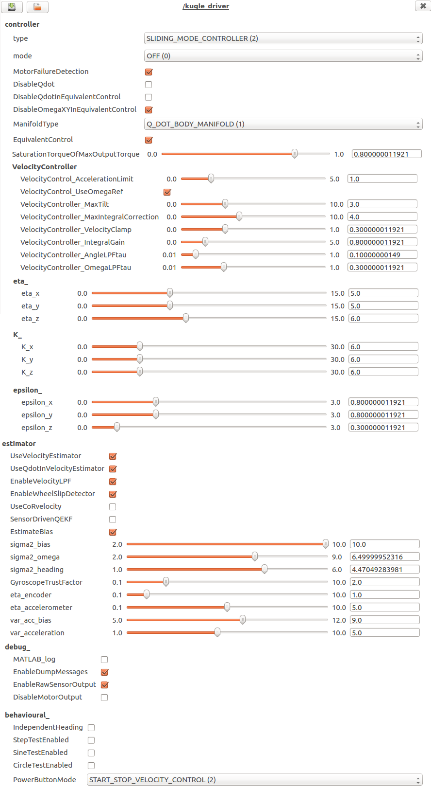
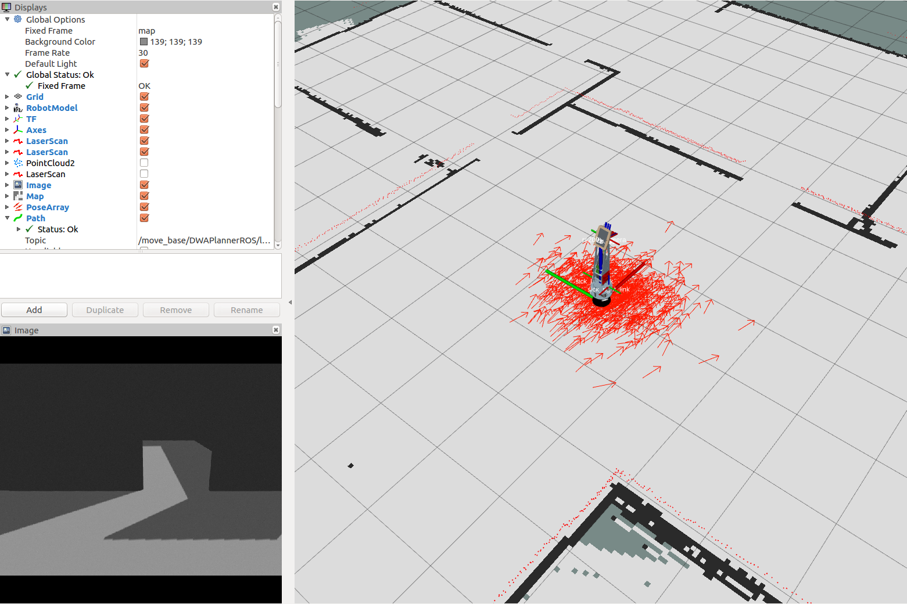
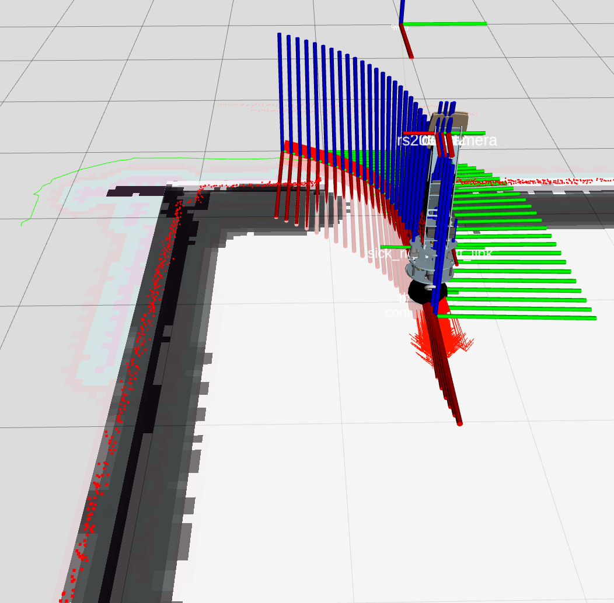
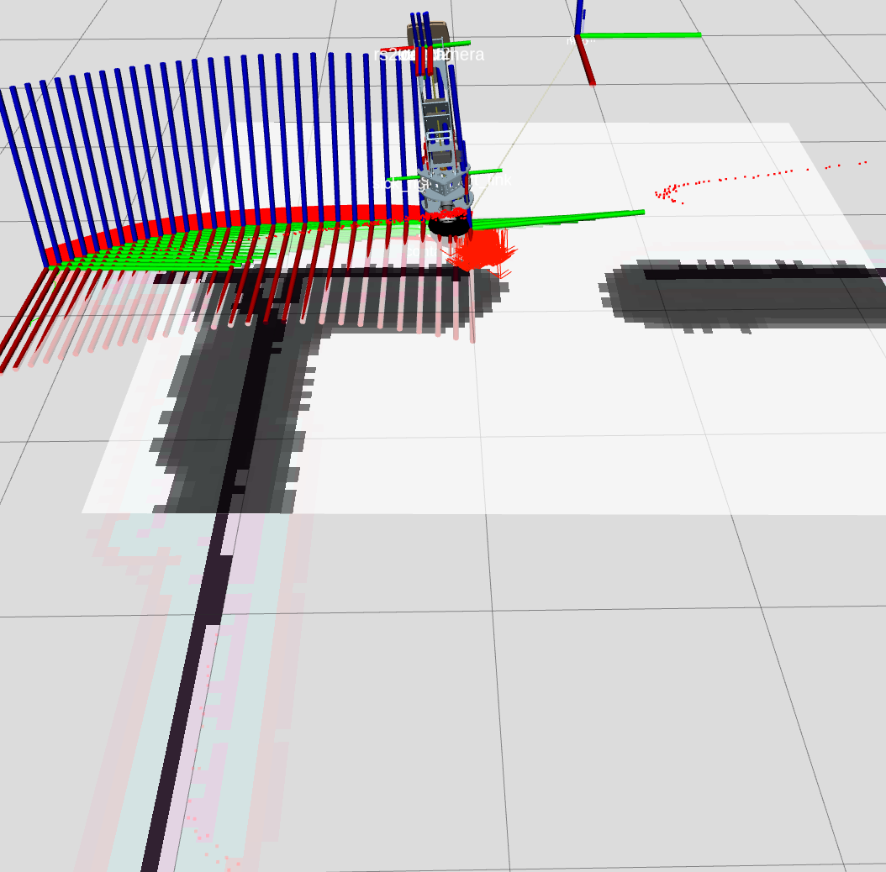

# Kugle-ROS
This repository contains the ROS workspace developed for the Kugle robot as part of the master thesis work described in [Kugle - Modelling and Control of a Ball-balancing Robot](https://github.com/mindThomas/Kugle-MATLAB/blob/master/Kugle%20-%20Modelling%20and%20Control%20of%20a%20Ball-balancing%20Robot.pdf), including the ROS driver interfacing with the embedded hardware and corresponding launch files for other high-level packages such as LiDAR localization using [`amcl`](http://wiki.ros.org/amcl), mapping using [`gmapping`](http://wiki.ros.org/gmapping) and navigation using a custom local planner based on a shape-accelerated model predictive controller.

An important aspect of the embedded firmware in [Kugle-Embedded](https://github.com/mindThomas/Kugle-Embedded) is to be able to exchange information with the ROS infrastructure. Using [LSPC](https://github.com/kdhansen/LSPC) and a USB connection, packages can be exchanged with the onboard computer. A ROS driver is developed to communicate with the embedded firmware and serves the purpose of bridging ROS topics to according messages, to and from the embedded firmware. Furthermore, a few ROS services are implemented to execute actions such as reboot, calibrate, changing parameters etc.

When connected the ROS driver automatically populates the [`tf`](http://wiki.ros.org/tf) tree with information from the state estimates computed in the embedded firmware. This allows a live view of the current position and orientation of the robot through the [`rviz`](http://wiki.ros.org/rviz) GUI. Furthermore a [Gazebo simulation](https://github.com/mindThomas/Kugle-Gazebo) of the Kugle robot is developed to follow the same design as this ROS driver, hence with the same topics and messages.

The repository is structured according to general ROS practices, see e.g. https://github.com/leggedrobotics/ros_best_practices/wiki

## Videos
Videoes of the ROS driver and Gazebo simulation from the 8 month development period can be found at the following [YouTube playlist](https://www.youtube.com/playlist?list=PLLtE4m3fKcOC_TuErjgOpTiI3abHPWM0x).

[](https://www.youtube.com/playlist?list=PLLtE4m3fKcOC_TuErjgOpTiI3abHPWM0x)

## Clone and Build
### Install necessary tools
```bash
sudo apt-get install python-catkin-tools
sudo apt-get install python-rosdep
```

### Cloning
To set up the simulation environment you need to clone the necessary repositories into an existing or new catkin workspace.
Follow the steps below to set up a new catkin workspace and clone:
```bash
mkdir -p ~/kugle_ws/src
cd ~/kugle_ws/src
catkin_init_workspace
git clone https://github.com/mindThomas/Kugle-Gazebo
git clone https://github.com/mindThomas/Kugle-ROS
git clone https://github.com/mindThomas/realsense_gazebo_plugin
cd ..
rosdep install --from-paths src --ignore-src -r -y
```

### Building
Build the project with catkin build
```bash
cd ~/kugle_simulation_ws
catkin build
source devel/setup.bash
```

# Topics
## Subscribed Topics
`cmd_vel` ([geometry_msgs/Twist](http://docs.ros.org/api/geometry_msgs/html/msg/Twist.html))  
 > Velocity reference defined in the heading frame, with the x-axis pointing forward. Only the x- and y-components are used from the linear velocity, while just the z-component is used from the angular velocity as the heading angular velocity reference. Note that these references are only used when the controller is in velocity control mode.
 
`cmd_vel_inertial` ([geometry_msgs/Twist](http://docs.ros.org/api/geometry_msgs/html/msg/Twist.html))
 > Velocity reference defined in the inertial frame. Only the x- and y-components are used from the linear velocity, while just the z-component is used from the angular velocity as the heading angular velocity reference. Note that these references are only used when the controller is in velocity control mode.
 
`cmd_quaternion` ([geometry_msgs/Quaternion](http://docs.ros.org/api/geometry_msgs/html/msg/Quaternion.html))
 > Orientation reference. Note that these references are only used when the controller is in quaternion control mode.

`cmd_combined` ([kugle_msgs/BalanceControllerReference](https://github.com/mindThomas/Kugle-ROS/blob/master/kugle_msgs/msg/BalanceControllerReference.msg))
 > Combined orientation and angular velocity reference, with the angular velocity defined in the body frame. Note that these references are only used when the controller is in quaternion control mode.

`cmd_combined_inertial` ([kugle_msgs/BalanceControllerReference](https://github.com/mindThomas/Kugle-ROS/blob/master/kugle_msgs/msg/BalanceControllerReference.msg))
 > Combined orientation and angular velocity reference, with the angular velocity defined in the inertial frame. Note that these references are only used when the controller is in quaternion control mode. 

## Published Topics
`odom` ([nav_msgs/Odometry](http://docs.ros.org/melodic/api/nav_msgs/html/msg/Odometry.html))
 > Odometry including velocity and position in inertial frame. Based on encoder measurements converted using a model of the kinematics. Published at 200 Hz.  

`imu` ([sensor_msgs/Imu](http://docs.ros.org/melodic/api/sensor_msgs/html/msg/Imu.html))
 > Accelerometer and gyroscope readings from the selected sensor used by the controller. Published at 200 Hz.  
 
`magnetometer` ([sensor_msgs/MagneticField](http://docs.ros.org/melodic/api/sensor_msgs/html/msg/MagneticField.html))
 > Magnetometer readings from the selected sensor. Published at 200 Hz.   
 
`battery` ([sensor_msgs/BatteryState](http://docs.ros.org/melodic/api/sensor_msgs/html/msg/BatteryState.html))
 > Battery measurements. Not used after `powerManagmentInfo` was introduced.
 
`powerManagmentInfo` ([kugle_msgs/powerManagmentInfo](https://github.com/mindThomas/Kugle-ROS/blob/master/kugle_msgs/msg/powerManagmentInfo.msg))
 > Custom battery and power management message containing the battery levels, current consumption and connected batteries.
 
`encoders` ([kugle_msgs/Encoders](https://github.com/mindThomas/Kugle-ROS/blob/master/kugle_msgs/msg/Encoders.msg))
 > Raw encoder readings converted to angles in radians. Published at 200 Hz.      
 
`controller_info` ([kugle_msgs/ControllerInfo](https://github.com/mindThomas/Kugle-ROS/blob/master/kugle_msgs/msg/ControllerInfo.msg))
 > Current controller type and mode. When the controller is running the message includes the current control torque and the delivered torque feedback. Published at 200 Hz.    

`state_estimate` ([kugle_msgs/StateEstimate](https://github.com/mindThomas/Kugle-ROS/blob/master/kugle_msgs/msg/StateEstimate.msg))
 > State estimates including the position and velocity in inertial frame, and the orientation and angular velocity of the body frame, given by a quaternion and quaternion derivative. Published at 200 Hz.
 
`mcu_debug` ([std_msgs/String](http://docs.ros.org/api/std_msgs/html/msg/String.html))
 > `printf` debug messages from the embedded firmware.
 
`mcu_load` ([std_msgs/String](http://docs.ros.org/api/std_msgs/html/msg/String.html))
 > RTOS Task list and corresponding MCU load.
 
`controller_debug` ([kugle_msgs/ControllerDebug](https://github.com/mindThomas/Kugle-ROS/blob/master/kugle_msgs/msg/ControllerDebug.msg))
 > Internal controller variables used for debugging and live visualization with e.g., [`rqt_plot`](http://wiki.ros.org/rqt_plot). Includes orientation and angular velocity references, converted Euler angles, torque setpoint, sliding variable etc. Published at 200 Hz
 
# Services
`/kugle/set_parameter` ([kugle_srvs/SetParameter](https://github.com/mindThomas/Kugle-ROS/blob/master/kugle_srvs/srv/SetParameter.srv))
 > Change a dynamic parameter in the embedded firmware. Parameters are categorized with a `type` string and a `param` string. The `value` is sent by a string and parsed automatically by the ROS driver. The acknowledge feedback indicates whether the parameter was changed successfully.
 
`/kugle/get_parameter` ([kugle_srvs/GetParameter](https://github.com/mindThomas/Kugle-ROS/blob/master/kugle_srvs/srv/GetParameter.srv))
 > Get the current value of a dynamic parameter from the embedded firmware. Parameters are categorized with a `type` string and a `param` string.

`/kugle/dump_parameters` ([kugle_srvs/DumpParameters](https://github.com/mindThomas/Kugle-ROS/blob/master/kugle_srvs/srv/DumpParameters.srv))
 > Dump all dynamic parameters. Currently the returned dump array is discarded and not used for anything.
 
`/kugle/store_parameters` ([kugle_srvs/StoreParameters](https://github.com/mindThomas/Kugle-ROS/blob/master/kugle_srvs/srv/StoreParameters.srv))
 > Store the current dynamic parameters internally in the microprocessor flash (in an emulated EEPROM), such that they become persistent even during a power cycle. Note that this is only effective if the [`ForceDefaultParameters`](https://github.com/mindThomas/Kugle-Embedded/blob/master/KugleFirmware/Libraries/Modules/Parameters/Parameters.h#L33) flag is disabled in the embedded firmware.
 
`/kugle/calibrate_imu` ([kugle_srvs/CalibrateIMU](https://github.com/mindThomas/Kugle-ROS/blob/master/kugle_srvs/srv/CalibrateIMU.srv))
 > Initiate a calibration of the IMU consisting of a gyroscope calibration following by an accelerometer alignment calibration. Before initiating the calibration the robot should be held in the upright position as close to equilibrium as possible and it should be held still during the whole calibration. Equilibrium is where the center of mass is right above the ball, hence the balance point where the robot does not fall over when turned off. Debugging output is printed in the terminal and on the `mcu_debug` topic during calibration.
 
`/kugle/calibrate_accelerometer` ([kugle_srvs/CalibrateAccelerometer](https://github.com/mindThomas/Kugle-ROS/blob/master/kugle_srvs/srv/CalibrateAccelerometer.srv))
 > Initiate an advanced bias and scale calibration of the accelerometer. During the calibration the robot should be slowly tilted and held on all six sides. A debugging output with guidance is printed in the terminal and on the `mcu_debug` topic during calibration. 
 
`/kugle/reboot` ([kugle_srvs/Reboot](https://github.com/mindThomas/Kugle-ROS/blob/master/kugle_srvs/srv/Reboot.srv))
 > Reboot the embedded firmware.  
  
`/kugle/enter_bootloader` ([kugle_srvs/EnterBootloader](https://github.com/mindThomas/Kugle-ROS/blob/master/kugle_srvs/srv/EnterBootloader.srv))
 > Enter USB bootloader for [Over-the-air MCU update](#over-the-air-mcu-update) instead of using the onboard J-Link JTAG debugger and programmer.
  
`/kugle/restart_controller` ([kugle_srvs/RestartController](https://github.com/mindThomas/Kugle-ROS/blob/master/kugle_srvs/srv/RestartController.srv))
 > Restart just the [Balance controller](https://github.com/mindThomas/Kugle-Embedded/tree/master/KugleFirmware/Libraries/Applications/BalanceController) task of the embedded firmware. This will restart all estimators and controllers into their initial state without rebooting the embedded firmware, and thus without changing the parameters.
  
 
# Notes
Descriptions and guides how to use this ROS project can be found in the notes below.

## USB rules file for automatic device detection
The MCU can automatically be detected and assigned to `/dev/kugle` when connecting it over USB if the rules file, `99-kugle.rules`, is installed.

To install the rules file, copy `99-kugle.rules` to `/etc/udev/rules.d/`.

## Minimal bringup launch
The bringup launch includes both the driver (as described below) and the SICK LiDAR drivers. This launch script should only be used on the onboard computer with the full system connected.
```bash
roslaunch kugle_bringup minimal.launch 
```

## Install as service on boot
A startup script and corresponding service (for starting at boot) for launching the minimal bringup launch file has been made.

Copy the `startup_launch.sh` and `PrepareHostROS.sh` to the home folder. Copy the file `kugle.service` into `/lib/systemd/system` and modify the path to the `startup_launch.sh` script accordingly and rename the user and group to the username on the device if different. Enable the service on boot by running:
```bash
sudo systemctl daemon-reload
sudo systemctl enable kugle.service
```

After the service has been installed the driver can be started, stopped or restarted by using:
```bash
sudo service kugle start
sudo service kugle stop
sudo service kugle restart
```

## Launching the driver
The driver which communicates with the MCU over USB can be launched either on a laptop connected through USB to the MCU or on the onboard connected over USB. Launch the driver by running
```bash
roslaunch kugle_driver kugle_driver.launch
```

# Usage
## Connecting to onboard computer ROS
The onboard computer automatically launches the minimal bringup launch file at boot and creates a WiFi hotspot named 'kugle'. Connecting to this hotspot gives access to the ROS Master created by the robot. To link a user computer to the ROS Master source the `ConnectROS.sh` script:
```bash
source ConnectROS.sh
```

## Reconfigure GUI (reconfigurable parameters)
The embedded firmware includes a global parameter server with some dynamically modifiable parameters. These parameters can be modified with dedicated LSPC messages described in the [Kugle-Embedded/.../API Protocol.pdf](https://github.com/mindThomas/Kugle-Embedded/blob/master/API%20Protocol.pdf). Since ROS already includes a way to modify parameters dynamically, known as reconfigurable parameters, the ROS driver is developed so that all modifiable parameters of the embedded firmware are published as reconfigurable parameters in the ROS driver. Whenever a reconfigurable parameter is modified in ROS, the ROS driver automatically sends the corresponding LSPC message to modify the parameter in the embedded firmware. Using the rqt_reconfigure GUI this makes especially tuning a lot faster. The reconfigurable parameters include e.g., the current control mode, sliding surface selection, sliding surface gain, switching gain, epsilon-tube, estimator tuning parameters, velocity controller gains, power button mode and flags for enabling reference tests.

To open the reconfigure GUI on a local computer connected to the ROS Master run the command
```bash
rosrun rqt_reconfigure rqt_reconfigure kugle_driver
```

<div align="center">

</div>

## RVIZ display
An RVIZ visualization of the robot can be launched by running
```bash
roslaunch kugle_launch rviz.launch
```



## kugle_driver MCU RTOS load
When the `kugle_driver` is running the MCU load is published on the topic `mcu_load` which can be displayed by running
```bash
rostopic echo /mcu_load -p
```

## Localization node
The two LiDARs can be used to determine the position and orientation of the Kugle robot. The simplest and yet fairly effective way of localizing with LiDAR is by using `amcl`. An `amcl` localization node can be started by running
```bash
roslaunch kugle_launch localization.launch
```

## Mapping
Before Kugle is able to localize it needs to construct a map of the environment. A mapping instance can be carried out with `gmapping` which can be started in a pre-configured mode for the Kugle robot by launching
```bash
roslaunch kugle_launch mapping.launch
```

## Playstation joystick control
In Velocity control mode the Kugle robot can be controlled remotely with a Playstation joystic. The wireless joystick connection is achieved using `ds4drv`
```bash
sudo pip install ds4drv
```

First ensure that Velocity control mode is enabled through the reconfigure GUI. Next connect to the Playstation joystick by opening a new terminal and write:
```bash
sudo ds4drv
```

Finally the joystick node can be launched to map the joystick inputs to corresponding velocity references.
```bash
roslaunch kugle_launch joystick.launch
```

Note that the above steps can either be performed on the onboard computer or on an external computer configured to communicate with the Kugle ROS Master, see above step about connecting to the onboard computer.


# Simulation
The ROS driver can be used with the Gazebo simulation of the Kugle found in https://github.com/mindThomas/Kugle-Gazebo

A simulation environment with ROS topics matching the ROS driver can be launched with
```bash
roslaunch kugle_launch simulation.launch
```

In the default RVIZ view opened after starting the simulation the Kugle robot will show up "white" because the `Fixed Frame` is set to `map` and the localization node has not be started. After running the `localization.launch` (see above) the Kugle robot should show up properly. Another option is to set the `Fixed Frame` to `world`.

## MPC simulation
A model predictive controller, derived using ACADO, has been implemented as a local planner for the Kugle robot. To run the MPC on the simulated Kugle robot the `localization` node has to be running. The MPC node is started by running
```bash
roslaunch kugle_launch mpc.launch
```

Navigation goals can now be set using the regular method of setting navigation goals, e.g. through RVIZ.

<div>

&nbsp;

</div>

# Development-specific notes
## Soft restart
The controller and estimators running inside the embedded firmware on the microprocessor can be restarted by running:
```bash
rosservice call /kugle/restart_controller
```

## Reboot MCU 
The microprocessor can be rebooted by calling:
```bash
rosservice call /kugle/reboot
```

## Calibrate IMU
Calibration of the IMU requires the robot to be positioned/aligned such that its' center of mass is located above the center of the ball. Hold the robot and find the balancing point and the run the calibration by calling:
```bash
rosservice call /kugle/calibrate_imu
```
The calibration computes an alignment rotation matrix to align the z-axis with the downward-pointing gravity direction. Since the calibration also involves calibrating the gyroscope bias, the robot should be held still during calibration.

When finished the calibration is automatically stored inside non-volatile memory of the microprocessor.

## Over-the-air MCU update
The MCU can be programmed either using the onboard USB programmer/debugger or using the built-in USB bootloader. If just the Client USB connection is connected to the STM32H7 board, only the built-in USB bootloader can be used. To enter the bootloader the system should be in OFF state (motors not running) whereafter the bootloader is entered by calling:
```bash
rosservice call /kugle/enter_bootloader
```
The firmware can now be updated using the functions described in https://github.com/mindThomas/Kugle-Embedded#dfu-bootloader-over-usb

## Debugging and logging
The ROS driver in combination with the embedded firmware from [Kugle-Embedded](https://github.com/mindThomas/Kugle-Embedded) includes two ways of debugging.

### `printf` support
An overload of the `printf` command is made in the embedded firmware in [`Kugle-Embedded/.../Debug.cpp`](https://github.com/mindThomas/Kugle-Embedded/blob/master/KugleFirmware/Libraries/Modules/Debug/Debug.cpp#L166-L186) as the function `Debug::printf(...)`. This function can be called anywhere in the firmware and the output is automatically directed to a debug LSPC message and sent over USB. When the ROS driver is running these debug messages are automatically printed in the terminal and also sent to the `mcu_debug` topic.

### MATLAB output and parsing
A dump functionality is included in the embedded firmware to enable logging. The dump functionality sends a few fully packed float arrays over USB, dumping everything that can possibly be dumped. The float arrays include raw sensor measurements from all sensors, e.g., both the MPU-9250 and MTI-200 IMU simultaneously, state estimates, computed control outputs, sliding variables, estimation error covariances etc. In the ROS driver these float arrays are automatically dumped into comma separated files, so that they can be loaded into MATLAB easily. The dump arrays are defined in [`Kugle-Embedded/.../BalanceController.cpp`](https://github.com/mindThomas/Kugle-Embedded/blob/1da3d5f95059f0f7a3147d7fae29ff62770ab6dc/KugleFirmware/Libraries/Applications/BalanceController/BalanceController.cpp#L817-L923), while a MATLAB loading script for processing the dumped data is found at [`Kugle-MATLAB/.../LoadDump.m`](https://github.com/mindThomas/Kugle-MATLAB/blob/master/DataProcessing/functions/LoadDump.m).